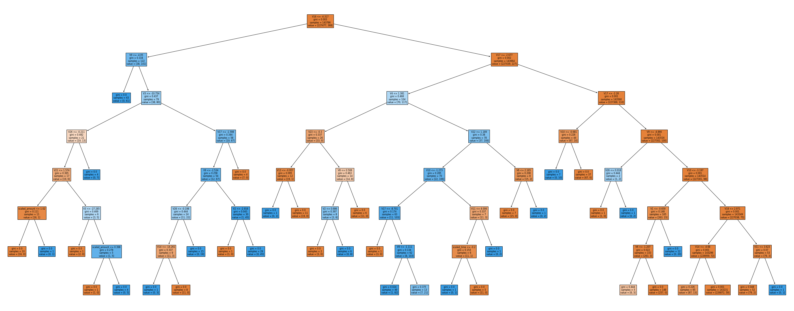
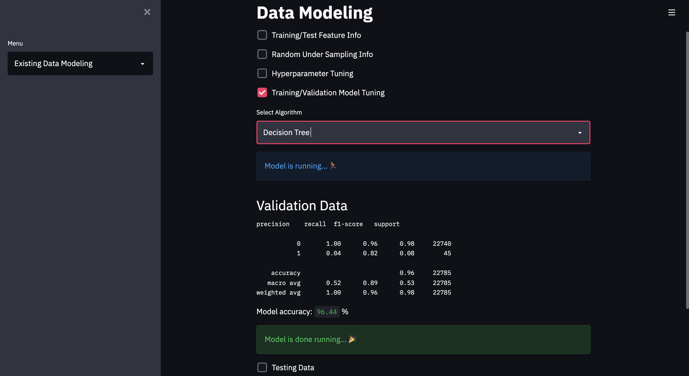

# :credit_card:	Credit Card Fraud Detection

## The Goal :pushpin:

The goal of this project was to practice data science skills as it relates to data cleaning, exploration, visualization and modeling.

## About the Data :card_file_box:

The dataset was sourced from [Kaggle](https://www.kaggle.com/mlg-ulb/creditcardfraud).
- The actual column names were masked.
- The target variable was converted to a numeric for us. 0 non fraud and 1 fraud.
- The data contains both outliers and imbalance datapoints.

## About the Project :moneybag:

- Classification problem.
- Handled imbalance data using Random Under Sampling.
- Data visualization conducted using pandas, seaborn and matplotlib.
- Data split into train/validation and test.
- Gridsearch CV used to find the best hyper-parameters a model.
- Algorithms used (Decision Tree, Support Vector Machine, Logistic Regression, Random Forest and K-Nearest Neighbors.)
- F1, Precision, Recall and Accuracy calculated.
- Streamlit for UI

## Data Modeling Recap :receipt:
### Training Data
| Algorithm | Training Accuracy (Gridsearch) | Validation Accuracy |
| --- | ----------- | ----------- |
| Decision Tree | 92.34% |  96.20 % |
| Support Vector Machine | 93.43% | 98.64 % |
| Logistic Regression | 93.58% | 98.06 % |
| Random Forest | 94.62% | 98.39 % |
| K-Nearest Neighbors | 94.03% | 96.39 %  |

### Test Data

Random Forest accuracy with Random Sampling: 98.57 %

Random Forest accuracy without Random Sampling: 99.95 %

## Streamlit UI :computer:

__Note: To run streamlit enter the command: streamlit run app.py__

#### Landing Page

#### Data Exploration on Load

#### Data Exploration Output

#### Existing Data Modeling on Load

#### Existing Data Modeling Output

#### New Data Modeling Dropdown Options

#### New Data Modeling Fields

#### New Data Modeling Output
